# Knowledge Forum Project

## Background and Motivation

This project was developed as part of the requirements for my degree at the university of Haifa, under the supervision of Professor Yotam Hod. The primary goal of this project is to create a knowledge-sharing forum where users can interact, share information, and access various resources in a structured community environment. The platform is designed to support multiple communities, each with its own discussion rooms, resources, and courses to foster learning and engagement.
## Project Overview

The Knowledge Forum provides a collaborative online space with various core features:

1. User Registration/Login: Secure authentication using Firebase Authentication.
2. Profile Management: Users can view and update their personal information.
3. Communities and Discussion Rooms: Users can join different communities, participate in discussions, and collaborate.
4. Courses: Users can enroll in courses, view course materials, and access course-specific discussion rooms.
5. Knowledge Forum (Detective Board): A space where users can save, organize, and connect ideas and notes.
6. FAQ and Contact Pages: Provides answers to common questions and a contact form for additional support.
## Features
* Registration/Login: Users can create an account or log in to access platform features.
* Multipurpose Toolbar: A navigation bar that provides quick access to main sections.
* Profile Page: Displays user information and provides editing options.
* Knowledge Forum (Detective Board): Allows users to visually organize notes and ideas, linking them as needed.
* Communities Page: Lists all available communities, with options for admins to create new communities.
* Courses: Shows available courses, allowing users to enroll and view materials. Admins can manage course content.
* Course-Specific Discussion Rooms: Discussion rooms focused on specific course topics.
* FAQ Page: Answers frequently asked questions to help users navigate the platform.
* Contact Us Page: A form for reaching out to the support team, with notifications sent to the team upon form submission.
* Logout and Password Reset: Options for users to log out and reset their passwords.
## Tech Stack

The project is built using the following technologies:

* Frontend: HTML, CSS, TypeScript, Angular, JavaScript
* Backend: Firebase Authentication, Firestore (Database), Firebase Storage
* Version Control: Git and GitHub for managing codebase versions and collaboration

## Installation and Setup
To run the project locally, follow these steps:
1. Clone the Repository:
    git clone https://github.com/RaneemIbra/Semestral-Project.git

2. Navigate to the Project Directory:
    cd Semestral-Project

3. Install Dependencies: Install necessary packages for Angular and Firebase:
    npm install

4. Configure Firebase:

* Create a Firebase project at Firebase Console.
* Enable Authentication, Firestore, and Storage in your Firebase project.
* Copy your Firebase configuration and add it to your project in src/environments/environment.ts.

5. Run the Application: Start the Angular development server:
    ng serve

6. Access the Project:
    Open your browser and go to http://localhost:4200

## Project Walkthrough

### Here’s a detailed walkthrough of the key pages and features of the Knowledge Forum platform:

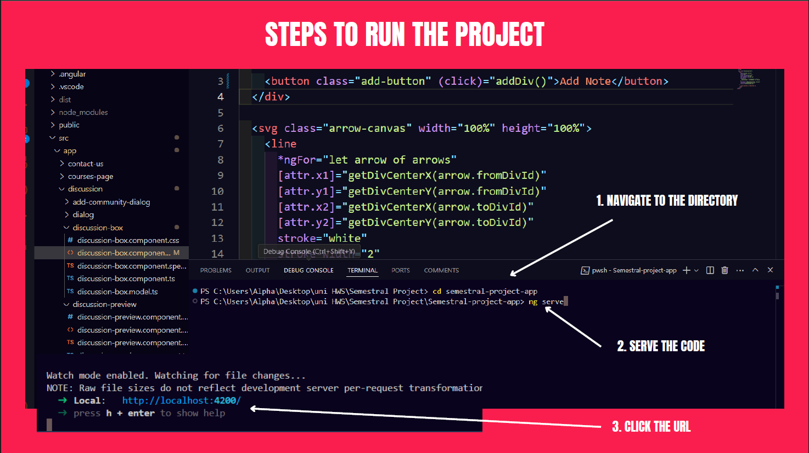

### This page allows users to sign up for a new account or log in to an existing one, with Firebase Authentication handling user authentication securely.

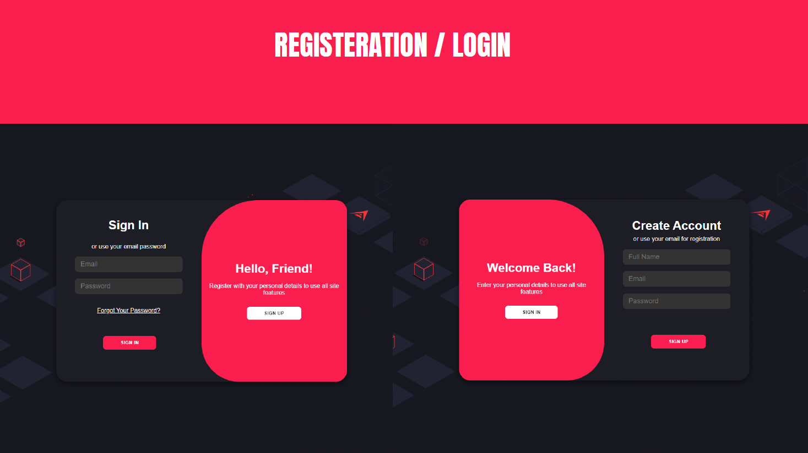

### The home page provides an overview of available communities, courses, and recent activity, helping users stay engaged and informed.

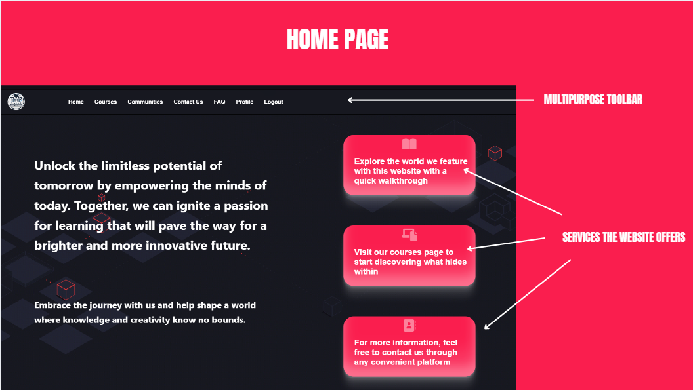

### Users can view and edit their profile information here, including updating personal details and account settings.

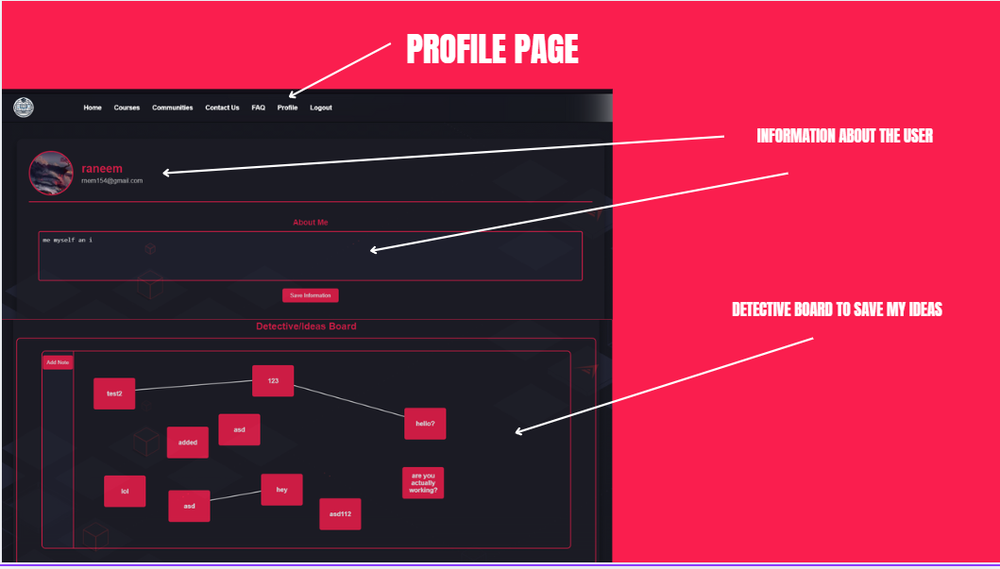

### A dedicated FAQ page provides answers to commonly asked questions, helping users navigate the platform with ease.
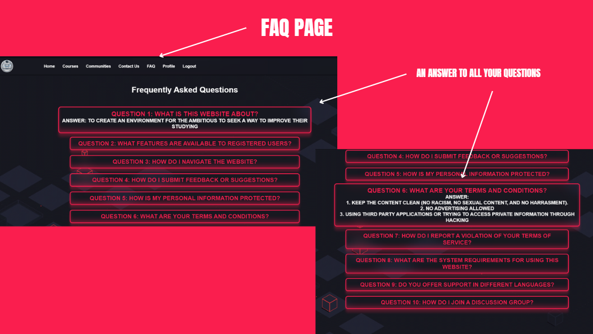

### Users can reach out for support or questions through this form. When submitted, the support team receives a notification.

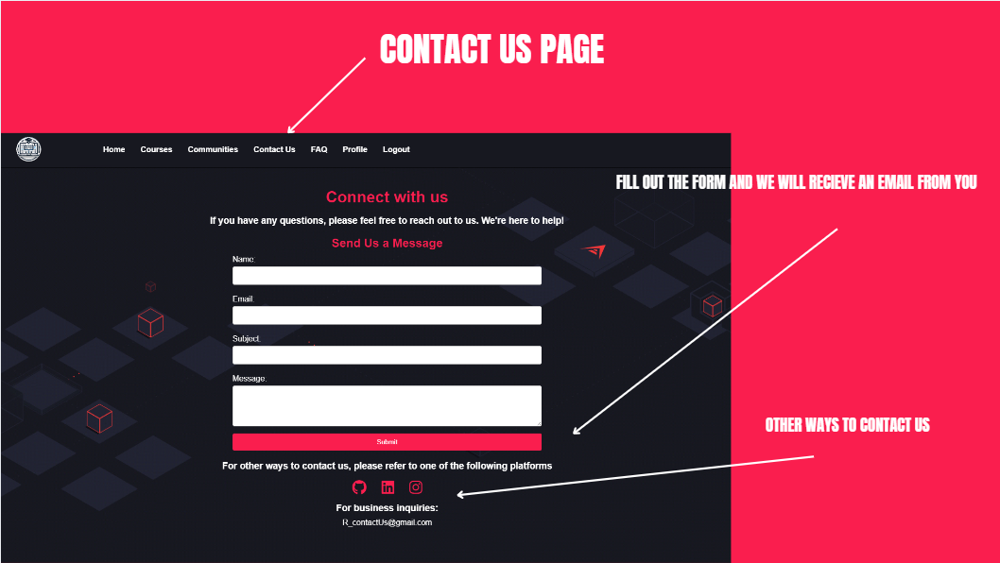

### This page lists all available communities on the platform. Users can join or leave communities and engage in discussions specific to each community.

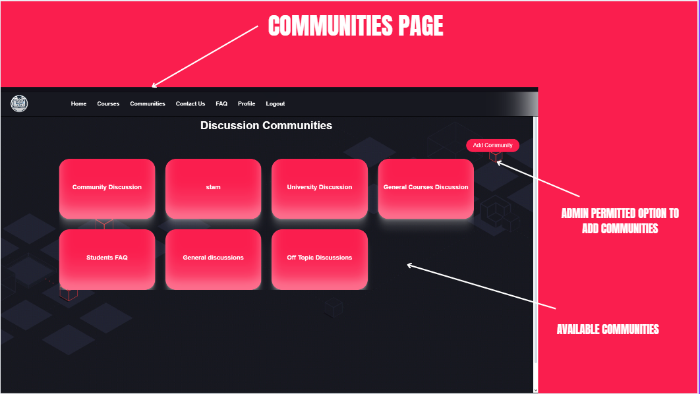

### Each community has its own discussion room, where users can post messages, reply to others, and collaborate on topics of shared interest.

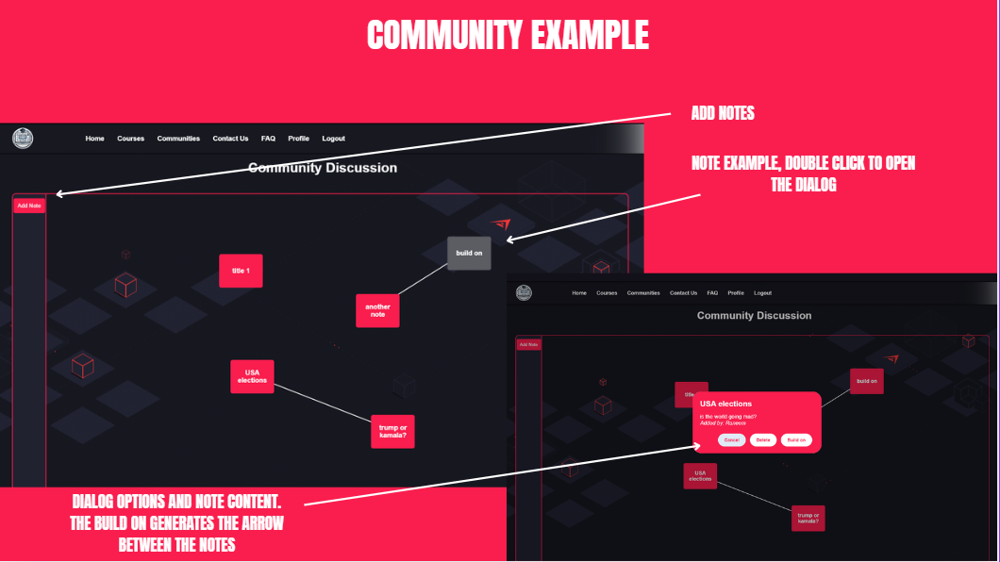

### A list of available courses, each with detailed information and access to course materials. Users can enroll in courses to gain access to exclusive content.

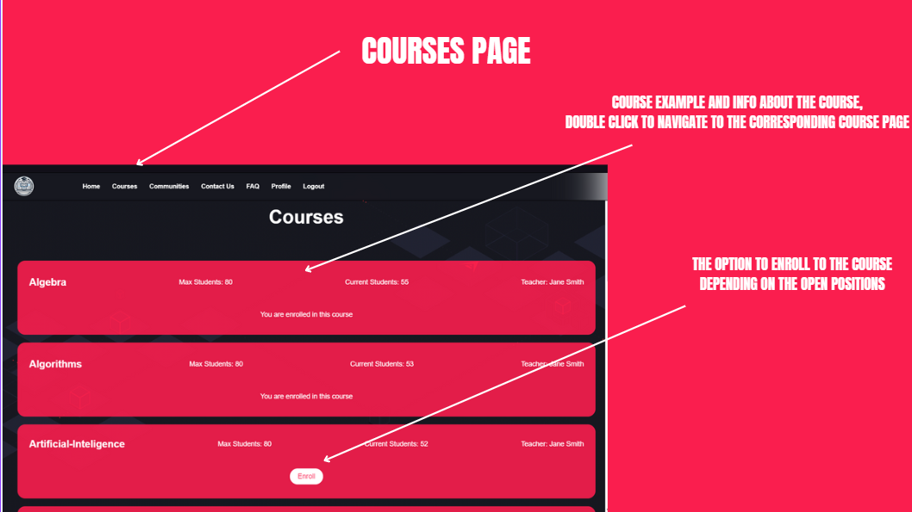

### The course page provides users with course-specific information, including lectures, assignments, and a dedicated discussion room.

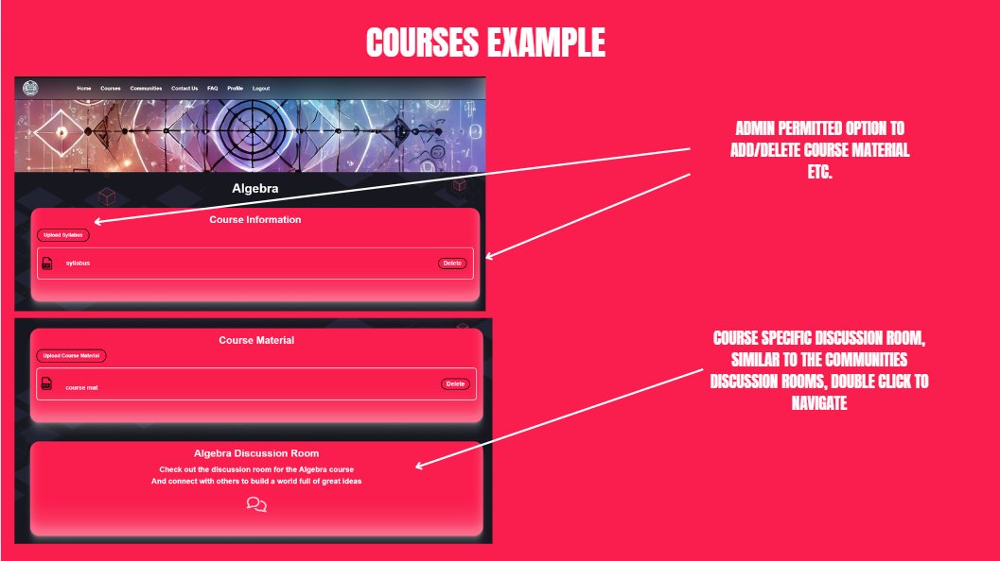

### Additional features like logout or password reset.

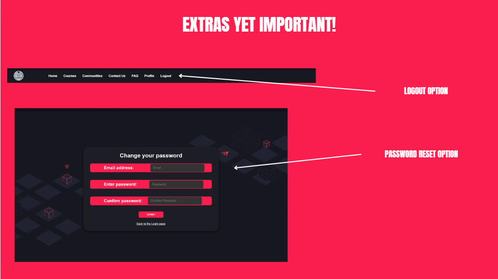